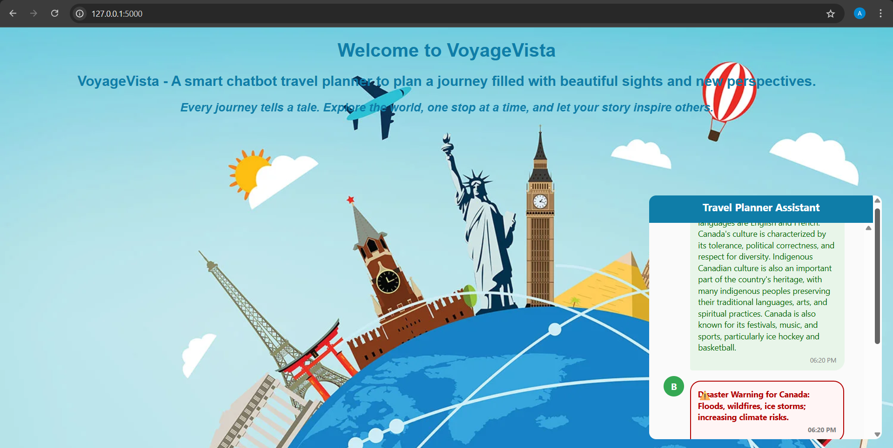
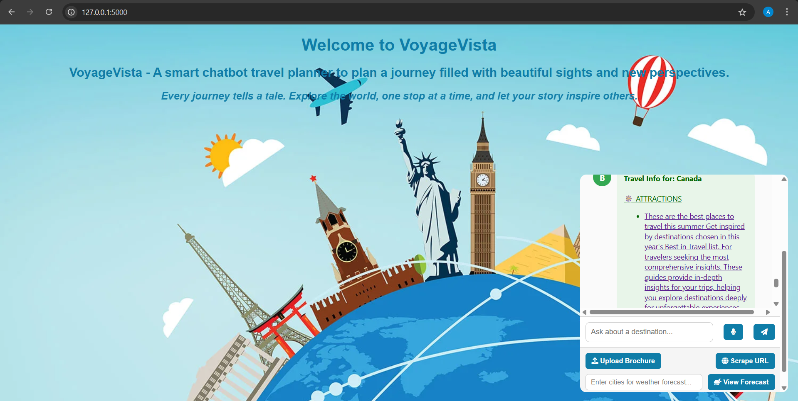

# TravelPlannerChatbot
## Use Case
   This project implements an AI-driven Travel Planner Chatbot that assists users in planning trips by answering queries related to weather, safety, attractions, and accommodations. Users can upload travel brochures, which are processed using OCR. The system scrapes trusted travel websites and summarizes the information in an admin dashboard. Disaster warnings and advisories are highlighted. Admins can monitor data, view persistent chat histories by session ID, and export reports. Weather data is auto-refreshed hourly. Out-of-scope queries are handled with polite, predefined messages
## Prerequisite
  Python Flask\
  Vector DB - pip install chromadb , pip install sentence-transformers\
  LLM - pip install google-generativeai\
  SQL DB - pip install pysqlite3
## Front End
User ask question about travel to Chatbot Screen.\

Scrapes URL from Attractions weather safety hotel web sites.\

